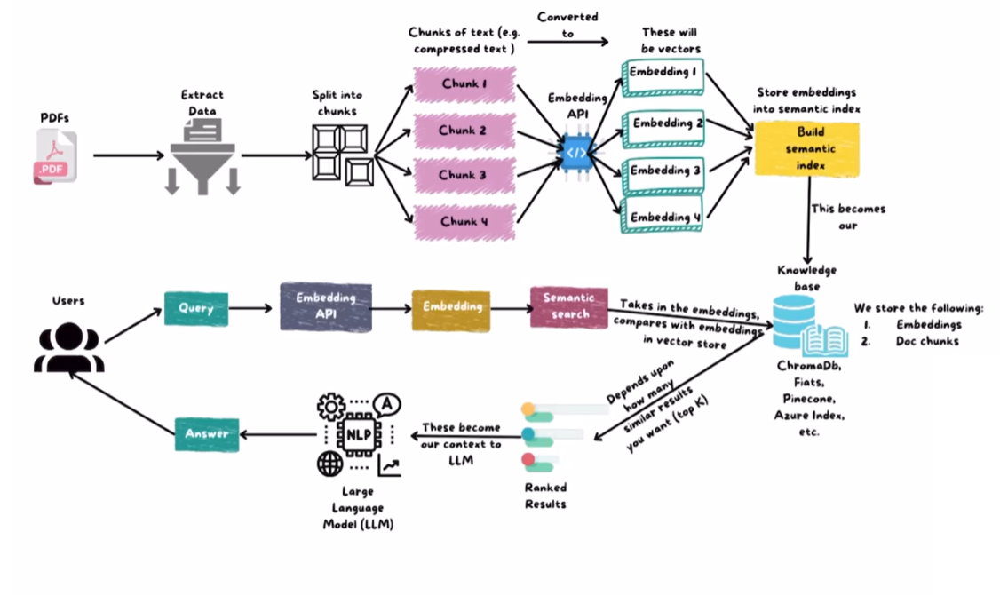

# Chatbot

A self-hosted Retrieval-Augmented Generation (RAG) chat application built on
ASP.NET Core. Upload your own documents (PDF, TXT, Markdown), then chat with
an LLM that grounds its answers in relevant excerpts retrieved from those
documents — running entirely on local infrastructure via Ollama, with no data
leaving your machine.

The app also includes a standard Customers/Orders/Products management
section (SQL Server-backed CRUD) and a second RAG pipeline — an internal
**Support Desk** chat that grounds staff Q&A in semantically retrieved order
data instead of uploaded documents. See [Order support & Support Desk
chat](#order-support--support-desk-chat) below.

## Purpose

Plain LLM chat answers from the model's training data alone, which can be
outdated, generic, or simply wrong about your private documents. Worse, the
model has no way to say "I don't know your internal docs" — it will
confidently fabricate plausible-sounding answers (hallucination) instead of
admitting it lacks the relevant information.

This project closes that gap with a practical RAG pipeline: ingest documents,
split them into chunks, embed those chunks as vectors, and at chat time
retrieve the most semantically relevant chunks to feed back into the LLM as
context — producing answers grounded in your own material instead of
hallucinated from general knowledge.

Why this matters in practice:

- **Up-to-date answers** — the model reasons over the documents you uploaded
  today, not a training snapshot that may be months or years old.
- **Domain/private knowledge** — works for material the base model never saw
  (internal docs, manuals, notes, niche references) without fine-tuning.
- **Traceable answers** — because responses are grounded in retrieved chunks,
  it's possible to see *which* excerpts informed an answer, making the system
  easier to trust and debug than an opaque end-to-end model.
- **Privacy by design** — ingestion, embedding, retrieval, and generation all
  run against a local Ollama instance and local PostgreSQL database; no
  document content or chat history is sent to a third-party API.
- **No retraining required** — adding new knowledge is as simple as uploading
  a new document; there's no fine-tuning step or model redeployment.

## How it works



1. **Ingestion** — user uploads a document (`.pdf`, `.txt`, `.md`). Text is
   extracted (PdfPig for PDFs, plain read for text formats), then recursively
   split into ~500-character overlapping chunks along paragraph/sentence/word
   boundaries to keep each chunk semantically coherent
   (`DocumentIngestionService`).
2. **Embedding** — each chunk is sent to a local Ollama embedding model
   (`nomic-embed-text`), returning a 768-dimension vector. Chunks and vectors
   are stored in PostgreSQL via the `pgvector` extension
   (`OllamaEmbeddingService`, `ApplicationDbContext`).
3. **Retrieval** — the user's question is embedded, and PostgreSQL performs a
   cosine-distance nearest-neighbor search (`<=>` operator via
   Pgvector.EntityFrameworkCore) to find the most relevant chunks
   (`RetrievalService`).
4. **Generation** — retrieved chunks, conversation history, and the question
   are assembled into a grounded system prompt and sent to a local Ollama chat
   model (`llama3.1:8b`) via Semantic Kernel (`OllamaChatService`).

## Tech stack

| Layer | Technology | Role |
|---|---|---|
| Web framework | ASP.NET Core MVC (.NET 10) | Controllers, Razor views, routing, DI |
| Database | PostgreSQL + `pgvector` extension | Stores documents, chunks, embeddings, chat history |
| Data access | EF Core + Npgsql + Pgvector.EntityFrameworkCore | ORM, vector column mapping, cosine-distance queries |
| LLM orchestration | Microsoft Semantic Kernel | Kernel, chat completion & embedding generation abstractions |
| LLM runtime | Ollama (local) | Hosts chat model (`llama3.1:8b`) and embedding model (`nomic-embed-text`) |
| PDF parsing | UglyToad.PdfPig | Extracts text from uploaded PDF documents |

## Project structure

Layered solution (`Chatbot.slnx`): `Domain` (entities, repository
interfaces) → `Infrastructure` (EF Core DbContexts, repositories,
Semantic Kernel/Ollama wiring) → `Application` (business services,
AutoMapper) / `Application.Dtos` (shared DTOs) → `Chatbot` (ASP.NET Core
MVC entry point).

```
Chatbot/Controllers/   HomeController, CustomersController, OrdersController,
                       ProductsController (CRUD over AppDbContext),
                       SupportDeskController (order-grounded RAG chat)
Application/Services/  OllamaEmbeddingService, OrderIngestionService,
                       OrderSemanticSearchService, OrderSupportChatService,
                       SupportFaqKnowledge, Order/Product/CustomerService
Infrastructure/        AppDbContext (SQL Server: Customers/Orders/Products),
                       VectorDbContext (PostgreSQL + pgvector: documents,
                       chunks, embeddings, order semantic-search index)
Domain/Entities/       Customer, Order, OrderDetail, OrderDocument, Product
Chatbot/Views/         Razor views (Home, Chat, Documents, Orders,
                       Customers, Products, SupportDesk)
```

See [CLAUDE.md](CLAUDE.md) at the repo root for the full architecture
breakdown and build/migration commands.

## Endpoints

| Route | Method | Purpose |
|---|---|---|
| `/` | GET | Landing page (`HomeController.Index`) |
| `/Documents` | GET | List uploaded documents and ingestion status |
| `/Documents/Upload` | POST | Upload a file (`.pdf`/`.txt`/`.md`), triggers ingestion pipeline |
| `/Chat?sessionId={id}` | GET | Open chat UI, optionally loading an existing session |
| `/Chat/NewSession` | POST | Create a new empty chat session |
| `/Chat/RenameSession` | POST (JSON) | Rename a session (`RenameSessionRequest`) |
| `/Chat/DeleteSession` | POST (JSON) | Delete a session and its messages (`DeleteSessionRequest`) |
| `/Chat/Send` | POST (JSON) | Submit a user message, run retrieval + generation, return assistant reply (`SendMessageRequest`) |

## Data model

```
Document 1───* DocumentChunk        Document: Id, FileName, ContentType,
                  │                            UploadedAt, chunk count
                  └─ Embedding (Vector, 768d, pgvector column)

ChatSession 1───* ChatMessage       ChatSession: Id, Title, CreatedAt
                                    ChatMessage: Id, Role (user/assistant),
                                                 Content, CreatedAt
```

Embeddings are stored as `Pgvector.Vector` columns (768 dimensions, matching
`nomic-embed-text` output) and indexed for cosine-distance (`<=>`) similarity
search — see `ApplicationDbContext.OnModelCreating` for the column/index setup
and `RetrievalService` for the query that ranks `DocumentChunk` rows by
distance to the question's embedding.

## Order support & Support Desk chat

Beyond the document-upload RAG chat above, the app runs a second, parallel
RAG pipeline over structured order data:

1. **Ingestion** — each `Order` row (with its line items) is rendered to
   text (`OrderDocumentTextBuilder`), embedded via the same Ollama embedding
   model, and stored as an `OrderDocument` row in the same pgvector-backed
   store used for documents (`OrderIngestionService`). Triggered via
   "Reindex" on the Orders page, or automatically as orders change.
2. **Retrieval** — a staff question is embedded and matched against
   `OrderDocument` rows by cosine distance (`OrderSemanticSearchService`),
   returning the most relevant orders. The `Orders/Search` page exposes this
   directly as a semantic order search.
3. **Chat** — `SupportDeskController` / `OrderSupportChatService` power a
   read-only staff chat (`/SupportDesk`) grounded in that retrieval:
   - Common questions (e.g. "what does Pending mean?", "how do I cancel an
     order?") are answered instantly from a canned FAQ list
     (`SupportFaqKnowledge`) without calling the LLM.
   - Questions naming a specific order (`#123`, "order id 123") resolve that
     order directly, even if it wasn't returned by semantic search; ids that
     don't exist are reported to the LLM as missing rather than guessed at.
   - Otherwise, semantically related orders are retrieved and fed to the LLM
     as grounding context alongside the FAQ text and conversation history.

This chat is strictly read-only — order status, contents, and totals can
only be viewed here; creating, editing, or deleting orders happens in the
Orders section of the app.

## Configuration

Set in `appsettings.json` (or environment overrides / user secrets):

```json
{
  "ConnectionStrings": {
    "DefaultConnection": "Server=<host>;Database=<db>;Trusted_Connection=True;TrustServerCertificate=True",
    "PostgresDefaultConnection": "Host=localhost;Port=5432;Database=<db>;Username=<user>;Password=<password>"
  },
  "Ollama": {
    "Endpoint": "http://localhost:11434",
    "ChatModel": "llama3.1:8b",
    "EmbeddingModel": "nomic-embed-text"
  }
}
```

`DefaultConnection` (SQL Server) backs Customers/Orders/Products;
`PostgresDefaultConnection` (PostgreSQL + pgvector) backs the document and
order-semantic-search RAG data.

## Running locally

1. Start a PostgreSQL instance with the `vector` extension available.
2. Start Ollama and pull the configured models:
   ```
   ollama pull llama3.1:8b
   ollama pull nomic-embed-text
   ```
3. Update the connection string and Ollama settings in `appsettings.json`.
4. Apply EF Core migrations for both DbContexts:
   ```
   dotnet ef database update -c AppDbContext -p src/Infrastructure -s src/Chatbot
   dotnet ef database update -c VectorDbContext -p src/Infrastructure -s src/Chatbot
   ```
5. Run the app:
   ```
   dotnet run
   ```
   Open the **Documents** page to upload material before chatting.

## Troubleshooting

- **Empty/irrelevant answers** — confirm documents finished ingesting (chunk
  count > 0 on the Documents page) and that `nomic-embed-text` is pulled; a
  missing embedding model causes silent ingestion failures.
- **Connection refused to Ollama** — verify `ollama serve` is running and
  `Ollama:Endpoint` matches its address (default `http://localhost:11434`).
- **`relation "vector" does not exist` / migration errors** — the `pgvector`
  extension must be created in the target database before running
  `dotnet ef database update` (`CREATE EXTENSION IF NOT EXISTS vector;`).
- **Slow retrieval on large corpora** — add an IVFFlat/HNSW index on the
  `Embedding` column (see pgvector docs); the default sequential scan is fine
  for small document sets but degrades as chunk counts grow.

## Limitations & possible extensions

- Single-user, no authentication — all sessions and documents are global.
- Fixed chunk size/overlap and a single embedding model; no support for
  re-ranking or hybrid (keyword + vector) search.
- No streaming of assistant responses — replies are returned in one shot.
- No deletion/re-ingestion workflow for documents (upload-only).
